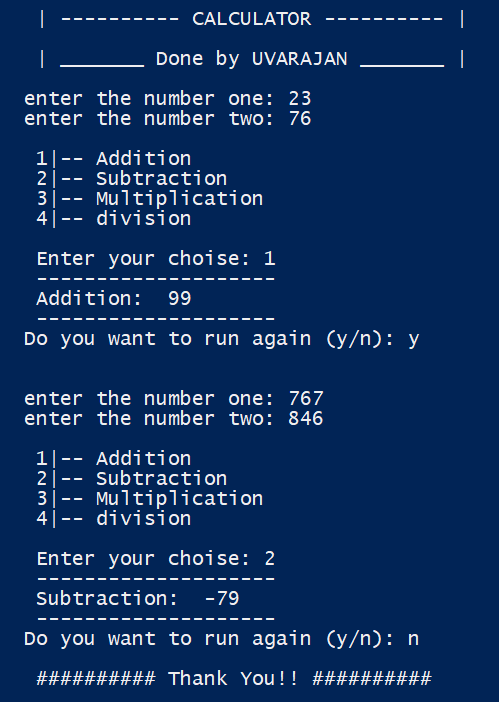
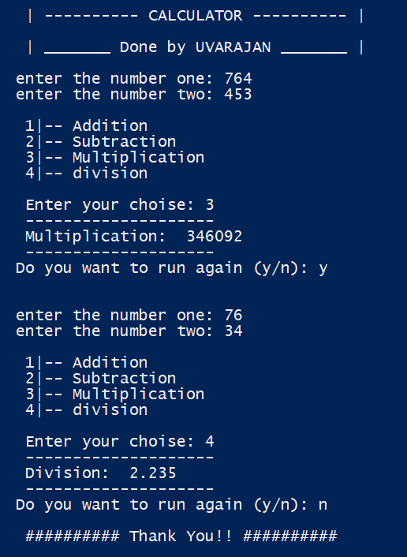
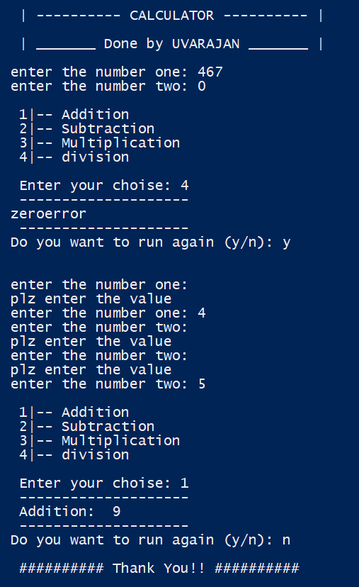

# Calculator Project

## Overview

This project is a calculator implemented in Python which  provides a basic funtionalities of calculator 

## Features

- Addition, subtraction, multiplication, and division operations.
- `crtl + c` to exit the program.


## Screenshots and Video
### Addition and Subtraction



### Multiplication and Division


### Error Handling


[Watch the project demo video](video/demo.mp4)

### Prerequisites

Make sure you have Python installed. You can download it from [python.org](https://www.python.org/).

To clone the project consider that **git** is instlled in your system.If not ypu can download it from [git](https://git-scm.com/downloads)

### Installation

1. Clone the repository:

```bash

    git clone https://github.com/UVARAJAND/CODSOFT.git

    cd CODSOFT

    cd calculator
```

2.Run python program
```bash
    python calculator.py
```
