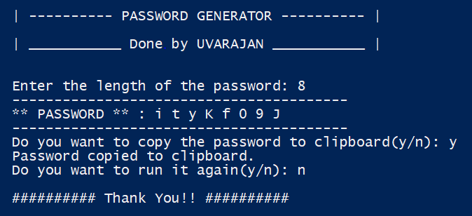
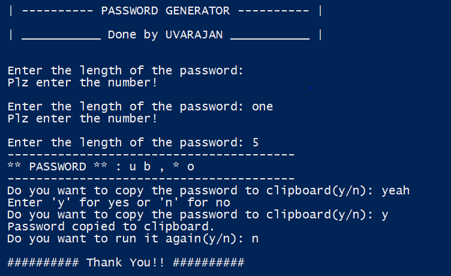

# Password Generator Project

## Overview

This <b>Password Generator</b> project provides a unique passwords which is the combinations of alphabets, numbers, special symbols etc.

It is done in <b>Python rogramming</b>

## Features

- Unique password generation
- `crtl + c` to exit the program.
- You can copy the password directly to `clipboard`


## Screenshots and Video
### Sample



### Error Handling


[Watch the project demo video](video/demo.mp4)

### Prerequisites

Make sure you have Python installed. You can download it from [python.org](https://www.python.org/).

To clone the project consider that **git** is instlled in your system.If not ypu can download it from [git](https://git-scm.com/downloads)

### Installation

1. Clone the repository:

```bash

    git clone https://github.com/UVARAJAND/_CODSOFT_.git

    cd Task2
```
2. Install the requirements
```
    pip install requirements.txt
```
3. Run python program
```bash
    python password_generator.py
```
## Contact

At linkedin [UVARAJAN D](https://www.linkedin.com/in/uvarajan-dev/)
